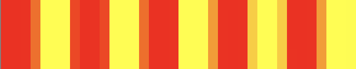

# Pixel Perfect -- Tutorial

<style type='text/css'>
p {
	text-align: justify;
}
img[alt=full] { width: 100%; }
img[alt=half] { width: 50%; }
img[alt=third] { width: 33%; }
img[alt=quarter] { width: 25%; }
img[alt=px375] { width: 375px; }
img + em {
	display: block;
	text-align: left;
	font-size: 0.9em;
	font-style: normal;
	font-weight: normal;
}
.col2 {
	column-count: 2;
	column-spacing: 100px;
	column-rule: 0px;
}
.col2 img {
}
</style>

Using iOS and Swift

[Go to the Xcode project.](https://github.com/htb/PixelPerfect)

Once upon a time we used to care about pixels -- the picture element. The more pixels, the higher resolutions, better looking text and images. After a while more pixels meant crisper screens and images. Nobody ever said 8 pixels any more (unless they meant “8 points”). The base unit for pixels had become megapixels.

As app developers we have now become accustomed to points. With points we draw the same relative distance on devices with different screen sizes and resolutions. They just look longer on bigger devices, and crisper on higher resolutions.

Some devices also have different dimensions measured in points, and then you get into the dilemma of whether to display more information, more spaced out, or to scale up images and text to the same relative sizes. And then you have different aspect ratios, and maybe the screen layouts better be totally different. The following ignores all of this.

But even then, some times different resolutions and automatic smoothing to accomodate the same image and drawing resolution on different physical media can make quite a mess. Let’s explore!

The following first explains the concepts of aliasing, antialiasing and upscale interpolation, and then moves on to play with this in code. And then finally we draw barcodes.


## Back to Aliasing

In the follwing I will be drawing into a 200x50 points view (blue background) on iPhone 8 and iPhone X simulators, displayed on a Mac with the simulators set to “Window => Actual Pixels”. My Macbook cannot display the full simulator with actual pixels in portrait orientation, so I have to flip it over to landscape first.

Let’s draw 5 red lines on a yellow background, i.e. there should be 10 alternating red and yellow lines. Let’s start at point resolution 1.0.


*10 vertical red and yellow lines using 10 points on an iPhone 8.*

One point is pretty small. So let’s zoom in:


*10 points on iPhone 8, zoomed.</br>
(10 points is 20 pixels on an iPhone 8.)*


Now let’s say this is an image that we need to stretch out a bit to fill a wider area. So we draw at scale 1.2 (20% bigger).


*Drawing 10 lines at scale 1.2 on iPhone 8. This then really covers a width of 12 points (24 pixels).*

<div class="col2">
<em>Zoomed in on iPhone 8.</em>
<em>Zoomed in on iPhone X.</em>
</div>

They zoomed in images on the iPhone 8 and iPhone 10 look different. So what is going on here? Why do they look different? We used 12 points width on both devices.

The difference is that the drawing has taken the physical pixel resolutions on the two different devices into account. The iPhone 8 has a native scale factor of 2.0, while the iPhone X has a scale factor of 3.0. This means that one *point* on the screen is actually represented using 2 or 3 actual *pixels*.


To learn more about iPhone resolutions and downscaling, check out [The Ultimate Guide To iPhone Resolutions](https://www.paintcodeapp.com/news/ultimate-guide-to-iphone-resolutions).


So why does this happen? This smoothing is done to make images appear prettier. Otherwise they would appear pixelated, especially at lower resolutions. Like the Space Invaders of the late ‘70s. This process of smoothing the jaggedness by averaging the colors of the pixels at the boundary is called *antialiasing*.


Wouldn´t we always want smooth and pretty images? Appearance is everything, right?

Now scroll back up at the zoomed images of lines from iPhone 8 and X. At a distance they look pretty similar. Although a bit fuzzy. Move closer again and spot the difference. Each line that we wanted to draw is not even similar to the other. So at a distance it appears the same to the eye, as is the intention, while at a close-up they it does not.

This is often a good thing, and that is why it is also the default drawing behaviour. If we had an image like this pixelated space invader it could look much smoother around the edges with antialiasing. A diagonal line looks smooth with antialiasing, while it would otherwise look jagged. But imagine we were drawing a thin red line that does not land exactly on the pixel. Instead it might have to be represented by two pixels. But since it would then be twice as thick without antialiasing, it is instead represented as something between, so orange in our case. So instead of a thin red line we get a fuzzy larger orange line. And if we move it half a pixel down we get a crisp red line again. This [Core Graphics tutorial](https://www.raywenderlich.com/411-core-graphics-tutorial-part-1-getting-started) explains this better.

For many use cases antialiasing is better. This aliased representation doesn’t look good at any distance. It looks crips as and correct as we only drew with the two colors red and yellow, but the widths of the lines look very wrong:


*Stretched without antialiasing.*

But what if we wanted an image to represent digital information for optical scanning, such as a product or an address? If it matters whether we pay the kilo price for safran or sand, or wether the baggage ends up in Austria or Australia.


## Enter Barcodes

Images for optical reading by cameras and laser scanners are all around us. Most common are the QR codes and barcodes. In the following we will be be using the Code128, used for shipping and packaging and a lot more.


*Barcode 128 (source: [Wikipedia](https://en.wikipedia.org/wiki/Code_128)).*

The code128 barcode consists of a blank “quiet” zone, a start symbol indicating which character set is used, then payload symbols, followed by a checksum symbol and a stop symbol and finally a quiet zone again. Apart from the stop symbol that is 13 bits wide, the rest of the symbols are 11 bits wide. One symbol is typically one ascii character, or two numerical digits. For our purpose here it is sufficient to know that each symbol/character is represented as an 11 digit bit code, and that each bit is drawn with a black line for a “1” and white for a “0”. The black bar that is wider than the thinner simply means it is a longer string of 1s in sequence.

Our aliased example above,


*Stretched without antialiasing, supposed to represent "1010101010".*

would perhaps spell out a binary string of “111011110111001110011100”, while it was supposed to be “1010101010” (alternating red and yellow bars of equal width).

So we can clearly not allow it to be stretched and aliased. Neither could we allow antialiasing. Well we could, if this was decoration for the human eye. But for optical equipment to read this, it must be clear where the 1 begins and where the 0 ends. If one line was gray, should it part of the 1 or the 0? Or from the “orange” case of the thin line above, would orange be 11 or 1?

This is when we need to consider our pixels, or native scale factor. We can draw bars with higher density than our point, but a bar must have width equal to an integer multiple of a pixel. So on the iPhone 8, with a scale factor of 2, we can represent 100 bits with a minumum of 100 pixels or next 200 pixels. I.e. 50 or 100 points. On the iPhone X, with a scale factor of 3, that would be 33 points or 66 points or next 99 points. So on the higher resolution display we have 3 possible scaled representations while only 2 on the lower. This severely restricts our layout options on lower resolution displays. On the Apple Watch we would only have one option.

<br/>
Now let’s start coding...


## Set up the test view

First, create a new single view app, call it “PPView” or whatever you like.
Then create a page like this:


Use autolayout to stack the stack views from the bottom.
For the buttons, set the tag property to 1, 5, 10, 20 and 100. We will pick the zoom factors from there later.

The purple zoom view is just a UIView with autolayout anchored at the bottom left, with not width or height constraint set.


## Image `scale` and view `contentScaleFactor`

These concepts require a bit of explanation before we move on with drawing. It is about pixel resolution and conversion from *pixel* to *point* coordinates.

The `contentScaleFactor` (say 3, as for iPhone X) for the view is simply a coordinate mapping from one point in the view to the pixel (3) on what it renders to; the physical screen. So at factor 3, 100 points will render to 300 pixels. For those views that have their own backing stores (typically *not* UIImageView), the resolution of the graphics is at the scale factor. I.e. 300 pixels for a view of 100 points in this case. (UIImageView renders directly from its `image` rather than first copying the image to the view's backing store.) So on a higher resolution device with a higher a higher resolution graphic or image in the view, the rendered graphic will look prettier.

Similarly, an image of `scale` (say 3) has an actual pixel representation that factor larger than its point size. So an image 100 points wide with a scale of 3 contains 100 pixels in width.

See this old but [brilliant article](https://www.objc.io/issues/3-views/moving-pixels-onto-the-screen/) to learn more about how graphics is drawn. Too bad it doesn't cover the scale factors, though.


## ZoomView

Now create a new class called ZoomView. Here’s the full code:

```swift

import UIKit


@IBDesignable
public class ZoomView: UIView
{
    @IBInspectable
    public var scale: CGFloat = 1.0
    {
        didSet {
            invalidateIntrinsicContentSize()
            setNeedsLayout()
            setNeedsDisplay()
        }
    }

    @IBInspectable
    public var image: UIImage? = nil
    {
        didSet {
            invalidateIntrinsicContentSize()
            setNeedsLayout()
            setNeedsDisplay()
        }
    }

    override public var intrinsicContentSize: CGSize
    {
        if let image = image {
            let s: CGFloat = scale * image.scale / self.contentScaleFactor
            return image.size * s
        }
        #if TARGET_INTERFACE_BUILDER
        return frame.size
        #endif
        return super.intrinsicContentSize
    }

    override public func draw(_ rect: CGRect)
    {
        super.draw(rect)

        guard let image = image else { return }

        // Draw image at native pixel resolution instead of point
        let context = UIGraphicsGetCurrentContext()!
        context.interpolationQuality = .none
        let s: CGFloat = scale * image.scale / self.contentScaleFactor
        image.draw(in: CGRect(origin: .zero, size: image.size * s))
    }

    override public func prepareForInterfaceBuilder()
    {
        super.prepareForInterfaceBuilder()

        self.awakeFromNib()
    }
}
```

A short run-through of this code:

* When the properties scale and image we need to calculate the size of the view again and update the display.
* The `intrinsicContentSize` calculates the size of the view that should be used if there are no other constraints restricting the size of the view. We want it to become as big as possible, that is why we didn’t set up any width and height constraints for the view in the storyboard.
* The `draw:rect` function is called by the OS when the view needs to be displayed. (We have specified that it needs to be displayed when the scale and image properties are changed.) In this function we resize the image according to its zoom factor (scale).

## Wire up the GUI

First we need to change the class of the placeholder UIView for our ZoomView to the new ZoomView class. Click on the zoom view and change the class here:


Next, wire up the conntections between the storyboard page and our main ViewController class. In our ViewController, create the following two outlets and two functions:

```swift
    @IBOutlet weak var _zoomView: ZoomView!
    @IBOutlet weak var _antialiasingSwitch: UISwitch!

    @IBAction func _zoom(_ sender: UIButton) { }
    @IBAction func _antialiasingSwitchChanged(_ sender: UISwitch) { }

```
Then control-drag a line from the storyboard page to their corresponding outlets and actions. Connect each button by dragging a line from each of them to the `_zoom:sender` action.

## Utils

We will need some utility functions later, so create a file to store them in. E.g. "Utils.swift". To make the code less verbose elsewhere, let’s create some simple extensions for `CGPoint` and `CGSize`:

```swift

import UIKit


extension CGPoint
{
    public init(_ x: CGFloat, _ y: CGFloat)
    {
        self.init(x: x, y: y)
    }
}


extension CGSize
{
    public init(_ width: CGFloat, _ height: CGFloat)
    {
        self.init(width: width, height: height)
    }

    public static func * (lhs: CGSize, rhs: CGFloat) -> CGSize
    {
        return CGSize(lhs.width * rhs, lhs.height * rhs)
    }

    public static func *= (lhs: inout CGSize, rhs: CGFloat)
    {
        lhs.width *= rhs
        lhs.height *= rhs
    }

    public static func / (lhs: CGSize, rhs: CGFloat) -> CGSize
    {
        return CGSize(lhs.width / rhs, lhs.height / rhs)
    }

    public static func /= (lhs: inout CGSize, rhs: CGFloat)
    {
        lhs.width /= rhs
        lhs.height /= rhs
    }
}
```

## DrawView

We will use a base class for all our drawing later on:

```swift
import UIKit


public class DrawView : UIView
{
    public var antialiasing: Bool = false {
        didSet {
            setNeedsDisplay()
        }
    }

    public internal(set) var image: UIImage? = nil
}
```

The `image` holds the result of the drawing so we can easily access it in the zoom view. The only property we will be changing at runtime is the antialiasing property. It will require a redraw of the view.

Next we add this view and make use of it in the view controller. Add this variable to `ViewController`:

```swift
    private var _drawView: DrawView!
```

When the antialiasing switch is toggled, we will set the property in `_drawView`:

```swift
    @IBAction func _antialiasingSwitchChanged(_ sender: UISwitch)
    {
        _drawView.antialiasing = sender.isOn
    }
```

And when any of the buttons are called, we use the tag value of the button class (that we specified for each button in Interface Builder) as the zoom factor, or `scale`:

```swift
    @IBAction func _zoom(_ sender: UIButton)
    {
        if let image = _drawView.image {
            _zoomView.image = image
            _zoomView.scale = CGFloat(sender.tag)
        }
    }
```

But the view is not yet part of our page. Let’s just add it from the view controller, and give it a background color of blue:

```swift
    override func viewDidLoad()
    {
        super.viewDidLoad()

        let rect = CGRect(origin: CGPoint(20, 40), size: CGSize(200, 50))

        let drawView = DrawView(frame: rect)

        _drawView = drawView

        _drawView.backgroundColor = UIColor.blue
        _drawView.contentMode = .topLeft
        _drawView.antialiasing = _antialiasingSwitch.isOn
        view.addSubview(_drawView)
    }
```

We can now run the app. It will do absolutely nothing except display a blue rectangle at the top. But we are ready to start drawing!


## Let's draw a line

Now let’s draw a single line. First change this line in `ViewController`:

```swift
        let drawView = LineView(frame: rect)
```

Then we need to implement LineView. We will be drawing a thin line from the bottom left to the top right of the view. We will be drawing into a new image context. We could have skipped this and drawn directly to the current context for the draw:rect function call, but since we want an image for the zoom view it is just as simple to do it this way:

```swift
import UIKit


class LineView: DrawView
{
    override public func draw(_ rect: CGRect)
    {
        super.draw(rect)

        let size = rect.size

        // Start a new image graphics content to draw our line to
        UIGraphicsBeginImageContext(size)
        let context = UIGraphicsGetCurrentContext()!
        context.setShouldAntialias(antialiasing)

        // Clear the background with white
        context.setFillColor(UIColor.white.cgColor)
        context.addRect(CGRect(origin: CGPoint.zero, size: size))
        context.drawPath(using: .fill)

        // Draw a black line from the bottom left to top right
        context.setStrokeColor(UIColor.black.cgColor)
        context.setLineWidth(1.0)
        context.move(to: CGPoint(0, size.height))
        context.addLine(to: CGPoint(size.width, 0))
        context.strokePath()

        // Make an image from the image context
        let image = UIGraphicsGetImageFromCurrentImageContext()!

        UIGraphicsEndImageContext()

        // Draw image in the view (using the now current graphics context)
        image.draw(at: CGPoint.zero)


        // Set the image property we will use for zooming
        self.image = image
    }
}
```

Run the app.

There should now be a white rectangle at the top with a black line across it. Play with the antialiasing switch and tap the various zoom buttons again to view the line up close.

<div class="col2">
<em>Aliased.</em>
<em>Antialiased.</em>
</div>

Now try with make this change to the DrawLine code:

```swift
        context.move(to: CGPoint(0, size.height-10.5))
        context.addLine(to: CGPoint(size.width, size.height-10.5))
```

You will see that when you use -10.5 on the iPhone 8 simulator (or phone), you will see the same black line whether it is aliased or antialiased. But if you change it to -10.0, you will get the effect explained earlier, where the antialiased line become thicker and gray:

<div class="col2">
<em>Aliased at one point thick at -10.0.</em>
<em>Antialiased at one point thick at -10.</em>
</div>


## Capture the draw view

So far we have only zoomed in on the image we created. We drew into an image context. This image is at scale 1. But we also rendered the image in the view when we used this method:

```swift

        image.draw(at: CGPoint.zero)
```

So what does the view look like? Let’s zoom in on the view. First we need to capture the view as an image; let’s take a “viewshot”. Begin by adding this to the `Utils.swift` file:

```swift
extension UIView
{
    public func capture() -> UIImage?
    {
        UIGraphicsBeginImageContextWithOptions(layer.bounds.size, true, UIScreen.main.scale)
        let context = UIGraphicsGetCurrentContext()!
        context.interpolationQuality = .none
        layer.render(in: context)
        let image = UIGraphicsGetImageFromCurrentImageContext()
        UIGraphicsEndImageContext()
        return image
    }
}
```

Make a note of this line:

```swift
        context.interpolationQuality = .none
```

We used the same in the zoom view, and I shall explain it shortly. But first we should make that viewshot. Now either add another switch, or simply change the first line in the `_zoom:sender` function to use `_drawView.capture()` instead. If you add another switch to the GUI you could instead connect it to an outlet

```swift
    @IBOutlet weak var _zoomViewSwitch: UISwitch!

```

and then change the line in the zoom function to this:

```swift

        if let image = (_zoomViewSwitch.isOn ? _drawView.capture() : _drawView.image) {
```

Now run the app and zoom at 1x, first the image and then the view:

<div class="col2">
<em>Zoomed image on iPhone X.</em>
<em>Zoomed view in iPhone X.</em>
</div>

We drew into an image of scale 1.0. But when we drew that image into the view at the view’s point size, the image was scaled up to fit the view. On iPhone X this becomes even more evident, with a content scale factor of 3. The “viewshot” image on the right has created an image from the view with `contentScaleFactor` of 3, making an image of scale 3. Now let’s have a closer look at the upscaled image that is displayed in the draw view:

<div class="col2">
<em>interpolationQuality = .default</em>
<em>interpolationQuality = .default, antialiased</em>
</div>

Even with antialiasing turned off it looks antialiased. This is not what we wanted. The cause of this is the use of interpolation when upscaling the image. The purpose is the same as for antialiasing; we rather want images to appear slightly fuzzier when we upscale them than to look jagged and pixelated. But in the case where we do not want antialiasing, we most often don’t want this interpolation either. When we zoomed in we wanted to display the exact same pixels, only enlarged. So we turned interpolation off. Now let’s do the same when we draw to the view. Add these lines above the image drawing in LineView so it reads:

```swift
        // Draw image in the view (using the now current graphics context)
        if !antialiasing {
            UIGraphicsGetCurrentContext()?.interpolationQuality = .none
        }
        image.draw(at: CGPoint.zero)
```

The default interpolation is going to haunt you when you display barcodes if you simply copy the code out there on the web that upscales the image using affine transformations. At least for small high resolution barcodes.


## Towards higher resolution

In our journey towards the high resolution barcode it is time to make those lines vertical, and to utilize the full pixel density of the device we are using.

Start  by changing this line in `ViewController`:

```swift
        let drawView = BarView(frame: rect)
```

Then we create the BarView class:

```swift

import UIKit


class BarView: DrawView
{
    override public func draw(_ rect: CGRect)
    {
        super.draw(rect)

        let image = _drawBars(numBars: 10)

        // Draw image in the view
        if !antialiasing {
            UIGraphicsGetCurrentContext()?.interpolationQuality = .none
        }
        image.draw(at: CGPoint.zero)

        self.image = image
    }

    private func _drawBars(numBars: CGFloat) -> UIImage
    {
        let scaleX: CGFloat = self.contentScaleFactor
        let scaleY: CGFloat = self.contentScaleFactor

        let drawSize = CGSize(width: numBars * scaleX, height: self.bounds.size.height * scaleY)

        UIGraphicsBeginImageContextWithOptions(drawSize, true, self.contentScaleFactor)
        let context = UIGraphicsGetCurrentContext()!
        context.setShouldAntialias(antialiasing)

        // Clear the background with white
        let rectangle = CGRect(origin: CGPoint.zero, size: drawSize)
        context.setFillColor(UIColor.white.cgColor)
        context.addRect(rectangle)
        context.drawPath(using: .fill)

        // Prepare to draw black lines
        context.setFillColor(UIColor.black.cgColor)

        // Draw (black lines)
        for p in 0..<Int(numBars) {
            if p % 2 == 0 {
                context.addRect(CGRect(x: CGFloat(p) * scaleX, y: 0, width: 1 * scaleY, height: drawSize.height))
                context.drawPath(using: .fill)
            }
        }

        // Make an image from the image context
        let cgimage = context.makeImage();
        let uiimage = UIImage(cgImage: cgimage!, scale: self.contentScaleFactor, orientation: .up)

        UIGraphicsEndImageContext()

        return uiimage
    }
}
```

This code is drawing five vertical black bars on a white background, creating ten bars of alternate black and white color. We are setting the image we draw into to have a scale equal to the content scale factor, as well as the final image we create from this for zooming from.

We are also drawing into a canvas larger than the point size of our view, actually we are drawing into something `contentScaleFactor` larger, which is the actual pixel resolution of our view and device. When we are drawing bars at the exact content scale we do not get antialiasing effects. Even if we stretch the horizontal drawing a bit to 3.2 on an iPhone X the antialiasing artifacts are not prominent:


*Antialiasing when stretched a factor of 3.2 on iPhone X (with scale factor of 3).*

For the following you may want to visit the storyboard and set the default value for the switches to “Off”.

Now let us replace the bar drawing and draw at maximum resolution. Increase the number of bars to 100 and draw bars of one pixel width only:

```swift
                context.addRect(CGRect(x: CGFloat(p), y: 0, width: 1, height: drawSize.height))
```

Now run it.


*100 bars on iPhone X Simulator at 1 bar per pixel.*

Wow that was tight. My simulator can’t even display it at actual pixels unless i flip it over in landscape mode. But zooming in reveals that it is actually as wanted. Both the image zoom and the view zoom:


*Zoomed in 20x on iPhone X.*

If you have a 3x scale physical device you can run the app there, then take a screenshot and zoom in for proof. If you change the background color of the main view to white it will also become apparent that the blacker first line is simply an optical illusion because it bordered to a darker color to the left.

Now we ***have to*** draw a bar code, right?

## From bars to Barcode

Code128 for “hello” using code B including 11 digits of quiet area on each side, would be:

```
00000000000		quiet zone
11010010000		start code B
10011000010		‘h’
10110010000		‘e’
11001010000		‘l’
11001010000		‘l’
10001111010		‘o’
10001001100		modulo 103 checksum
1100011101011	stop character
00000000000		quiet zone
```

Replace this line:

```swift
        let image = _drawBars(numBars: 100)
```

with


```swift
        let patterns: [String] = [
            "00000000000",    // quiet zone
            "11010010000",    // start code B
            "10011000010",    // 'h'
            "10110010000",    // 'e'
            "11001010000",    // 'l'
            "11001010000",    // 'l'
            "10001111010",    // 'o'
            "10001001100",    // modulo 103 checksum
            "1100011101011",  // stop character
            "00000000000"     // quiet zone
        ]
        let image = _drawBitString(patterns.joined(), barWidth: 1)
```

Then implement the missing function:

```swift
    private func _drawBitString(_ bitString: String, barWidth: Int = 1) -> UIImage
    {
        let scaleX: CGFloat = self.contentScaleFactor
        let scaleY: CGFloat = self.contentScaleFactor

        let drawSize = CGSize(width: CGFloat(bitString.count * barWidth), height: self.bounds.size.height * scaleY)

        // Draw into an image with scale 1, where 1 point is 1 pixel
        UIGraphicsBeginImageContextWithOptions(drawSize, true, 1.0)
        let context = UIGraphicsGetCurrentContext()!
        context.setShouldAntialias(antialiasing)

        // Draw (black lines)
        for (i, c) in bitString.enumerated() {
            context.setFillColor((c == "1" ? UIColor.black : UIColor.white).cgColor)
            context.addRect(CGRect(x: CGFloat(i * barWidth), y: 0, width: CGFloat(barWidth), height: drawSize.height))
            context.drawPath(using: .fill)
        }

        // Make an image from the image context, with scale equal to the view.
        let cgimage = context.makeImage();
        let uiimage = UIImage(cgImage: cgimage!, scale: self.contentScaleFactor, orientation: .up)

        UIGraphicsEndImageContext()

        return uiimage
    }
```

We don’t need any higher resolution than one pixel per bar, so we draw into an image with scale 1 and the width we need.

Run the app and see the minimum barcode representation of the workd “hello” on this device. Try experienting by increasing the barWidth argument to see the steps at which the barcode must be resized in order to preserve an accurate representation.


*“hello” in barcode128 at 1px per bar on iPhone X.*

So can we scan this? In theory, yes. I am unable to scan it with my own iPhone X from another physical iPhone X, unless I double the bar size (or zoom to 2x). However, if I turn my iPhone X simulator to landscape and display it on my external screen, then select “Window => Pixel Accurate”; then I can easily scan it at 1x.


## Drawing barcodes with CIFilter

The final thing we shall do is to use CIFilter to draw a bardcode image, because that also includes the functionality to generate the image from a text string. “CI” is CoreImage, a framework from Apple for image processing and analysis. It is accessible via UIKit. It also comes with a lot of filters for generating optical codes such as QR codes and various barcodes. Let’s do the simplest possible implementation for Barcode128 as an extension to UIImage:


```swift
extension UIImage
{
    public static func barcode128(from code: String) -> UIImage?
    {
        let data = code.data(using: String.Encoding.ascii)
        if let filter = CIFilter(name: "CICode128BarcodeGenerator") {
            filter.setValue(data, forKey: "inputMessage")
            if let output = filter.outputImage {
                return UIImage(ciImage: output, scale: 1.0, orientation: .up)
            }
        }
        return nil
    }
}
```

This function creates a Barcode128 image at scale 1 .

Then create another draw view called `BarcodeView`:

```swift

class BarcodeView: DrawView
{
    public var code: String? = nil {
        didSet {
            setNeedsDisplay()
        }
    }

    override public func draw(_ rect: CGRect)
    {
        super.draw(rect)

        guard let code = code else { self.image = nil; return }

        // Get our barcode using CIFilter
        let image = UIImage.barcode128(from: code)!
        self.image = image

        // This created an image with a bar size of 1 pixel, but with a scale at the screen content size,
        // which means the image will be displayed at point size, unless we scale it down when we draw it to the screen

        // First make sure we do not get any smoothing when resizing
        let context = UIGraphicsGetCurrentContext()!
        context.interpolationQuality = .none

        // Then draw to our new scale
        image.draw(in: CGRect(origin: .zero, size: image.size / contentScaleFactor))

        // The image in the view should now have a bar width of one, corresponding to a full pixel
    }
}
```

Finally, create the view in ViewController:

```swift
        let drawView = BarcodeView(frame: rect)
        drawView.code = "hello"
```

Run it!


*Barcode128 “hello” created with CIFilter on iPhone X.*

Apart from a little smaller quiet zone and top and bottom padding, it is the same code that we drew before. But now you can simply set a new code with codeView.code and it will display a new barcode. (However, it will not resize the view as needed. If you want to extend this with proper intrinsic content size for autolayout and resize then you can look at ZoomView as a template.)


## Conclusion

This article has explained and demonstrated how antialiasing and interpolation works in iOS. And how to work without them. We have drawn into views, zoomed in on our views and images. We have drawn lines and barcodes using the full pixel density of high resolution iPhone displays. And we have proven that we can display and scan barcodes too small to distinguish for the human eye (at least mine :-).

## But wait...

Is this really pixel perfect? The short answer is “no”. Damn! After all this… For iPhone 8 and iPhone X it is. But for example the iPhone 8 Plus has a native content scale of 2.608, but it has a UIKit content scale factor of 3.0. Points are rendered to an intermediate pixel buffer and then finally downscaled to the actual physical size. So it is not exactly the same in the iPhone 8 Plus case. Then if you enable display zoom it gets even more complicated. But this article ends here :-)
