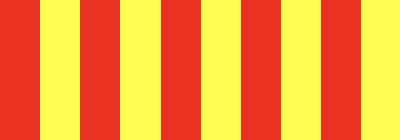
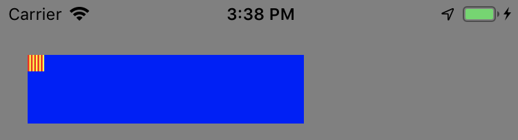
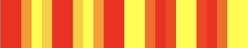
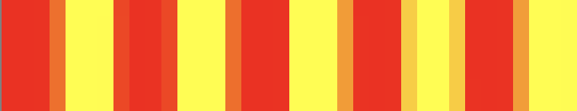
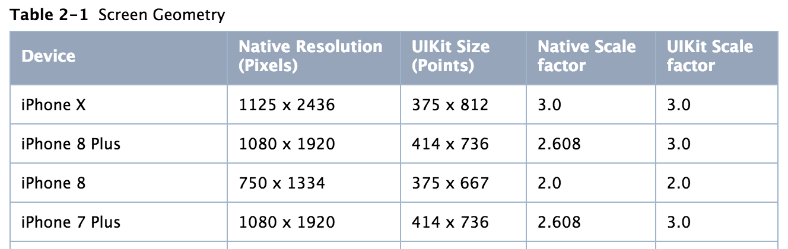
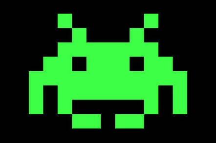
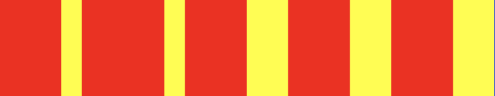
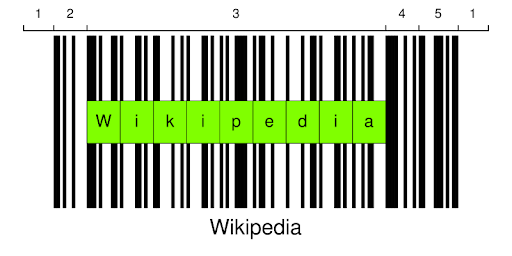

# Pixel Perfect

[Using iPhone and Swift]

[Back to the Xcode project.](https://github.com/htb/PixelPerfect)

Once upon a time we used to care about pixels -- the picture element. The more pixels, the higher resolutions, better looking text and images. After a while more pixels meant crisper screens and images. Nobody ever said 8 pixels any more (unless they meant “8 points”). The base unit for pixels had become megapixels.

As app developers we have now become accustomed to points. With points we draw the same relative distance on devices with different screen sizes and resolutions. They just look longer on bigger devices, and crisper on higher resolutions.

Some devices also has different dimensions measured in points, and then you get into the dilemma of whether to display more information, more spaced out, or to scale up images and text to the same relative sizes. And then you have different aspect ratios, and maybe the screen layouts better be totally different. The following ignores all of this.

But event then, some times different resolutions and automatic smoothing to accomodate the same image and drawing resolution on different physical media can make quite a mess. Let’s explore.

## Back to Aliasing

In the follwing I will be drawing into a 200x50 points view (blue background) on iPhone 8 and iPhone X simulators, displayed on a Mac with the simulators set to “Window => Actual Pixels”. My Macbook cannot display the full simulator with actual pixels in portrait orientation, so I have to flip it over to landscape first.

Let’s draw 5 red lines on a yellow background, i.e. there should be 10 alternating red and yellow lines. Let’s start at point resolution 1.0.

// TODO IMAGE WITH CAPTION

*10 vertical red and yellow lines using 10 points on an iPhone 8.*

One point is pretty small. So let’s zoom in:

*10 points on iPhone 8, zoomed. 
(10 points is 20 pixels on an iPhone 8.)*

Now let’s say this is an image that we need to stretch out a bit to fill a wider area. So we draw at scale 1.2 (20% bigger).

*Drawing 10 lines at scale 1.2 on iPhone 8. This then really covers a width of 12 points (24 pixels).*

<em>Zoomed in on iPhone 8.</em>
<em>Zoomed in on iPhone X.</em>

They zoomed in images on the iPhone 8 and iPhone 10 look different. So what is going on here? Why do they look different? We used 12 points width on both devices.

The difference is that the drawing has taken the physical pixel resolutions on the two different devices into account. The iPhone 8 has a native scale factor of 2.0, while the iPhone X has a scale factor of 3.0. This means that one *point* on the screen is actually represented using 2 or 3 actual *pixels*.

To learn more about iPhone resolutions and downscaling, check out [The Ultimate Guide To iPhone Resolutions](https://www.paintcodeapp.com/news/ultimate-guide-to-iphone-resolutions).

So why does this happen? This smoothing is done to make images appear prettier. Otherwise they would appear pixelated, especially at lower resolutions. Like the Space Invaders of the late ‘70s. This process of smoothing the jaggedness by averaging the colors of the pixels at the boundary is called *antialiasing*.

Wouldn´t we always want smooth and pretty images? Appearance is everything, right?

Now scroll back up at the zoomed images of lines from iPhone 8 and X. At a distance they look pretty similar. Although a bit fuzzy. Move closer again and spot the difference. Each line that we wanted to draw is not even similar to the other. So at a distance it appears the same to the eye, as is the intention, while at a close-up they it does not.

This is often a good thing, and that is why it is also the default drawing behaviour. If we had an image like this pixelated space invader it could look much smoother around the edges with antialiasing. A diagonal line looks smooth with antialiasing, while it would otherwise look jagged. But imagine we were drawing a thin red line that does not land exactly on the pixel. Instead it might have to be represented by two pixels. But since it would then be twice as thick without antialiasing, it is instead represented as something between, so orange in our case. So instead of a thin red line we get a fuzzy larger orange line. And if we move it half a pixel down we get a crisp red line again. This [Core Graphics tutorial](https://www.raywenderlich.com/411-core-graphics-tutorial-part-1-getting-started) explains this better.

For many use cases antialiasing is better. This aliased representation doesn’t look good at any distance. It looks crips as and correct as we only drew with the two colors red and yellow, but the widths of the lines look very wrong:

*Stretched without antialiasing.*

But what if we wanted an image to represent digital information for optical scanning, such as a product or an address? If it matters whether we pay the kilo price for safran or sand, or wether the baggage ends up in Austria or Australia.

## Enter Barcodes

Images for optical reading by cameras and laser scanners are all around us. Most common are the QR codes and barcodes. In the following we will be be using the Code128, used for shipping and packaging and a lot more.

*Barcode 128 (source: [Wikipedia](https://en.wikipedia.org/wiki/Code_128)).*

The code128 barcode consists of a blank “quiet” zone, a start symbol indicating which character set is used, then payload symbols, followed by a checksum symbol and a stop symbol and finally a quiet zone again. Apart from the stop symbol that is 13 bits wide, the rest of the symbols are 11 bits wide. One symbol is typically one ascii character, or two numerical digits. For our purpose here it is sufficient to know that each symbol/character is represented as an 11 digit bit code, and that each bit is drawn with a black line for a “1” and white for a “0”. The black bar that is wider than the thinner simply means it is a longer string of 1s in sequence.

Our aliased example above,

*Stretched without antialiasing, supposed to represent "1010101010".*

would perhaps spell out a binary string of “111011110111001110011100”, while it was supposed to be “1010101010” (alternating red and yellow bars of equal width).

So we can clearly not allow it to be stretched and aliased. Neither could we allow antialiasing. Well we could, if this was decoration for the human eye. But for optical equipment to read this, it must be clear where the 1 begins and where the 0 ends. If one line was gray, should it part of the 1 or the 0? Or from the “orange” case of the thin line above, would orange be 11 or 1?

This is when we need to consider our pixels, or native scale factor. We can draw bars with higher density than our point, but a bar must have width equal to an integer multiple of a pixel. So on the iPhone 8, with a scale factor of 2, we can represent 100 bits with a minumum of 100 pixels or next 200 pixels. I.e. 50 or 100 points. On the iPhone X, with a scale factor of 3, that would be 33 points or 66 points or next 99 points. So on the higher resolution display we have 3 possible scaled representations while only 2 on the lower. This severely restricts our layout options on lower resolution displays. On the Apple Watch we would only have one option.
